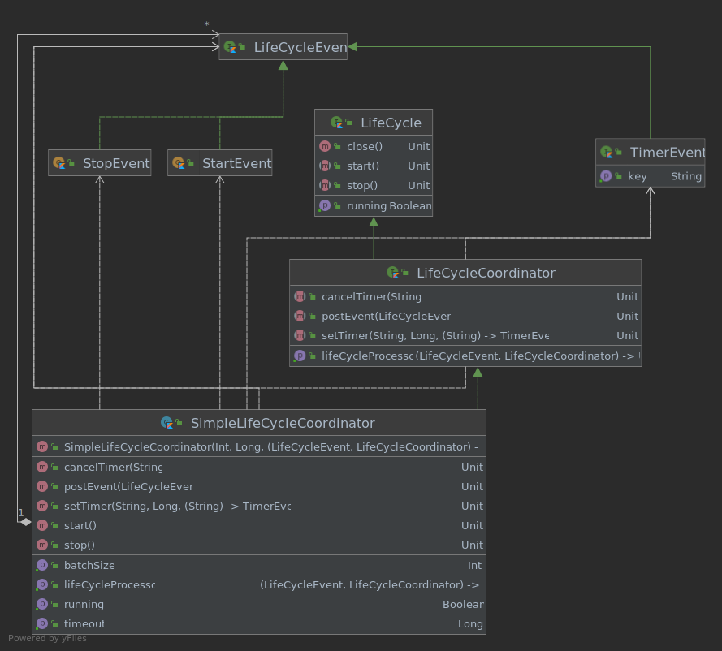

# LifeCycle

This module defines the interfaces and classes to coordinate Corda components.



Start and stop operations should be coordinated to sort the sequence
components are started and stopped.

The `net.corda.lifecycle.LifeCycleCoordinator` implementations schedules `net.corda.lifecycle.LifeCycleEvent` objects
processed by `lifeCycleProcessor`, a lambda function parameter of the coordinator.

The `lifeCycleProcessor` executes the proper logic according the type of `net.corda.lifecycle.LifeCycleEvent`.


The module provides the `net.corda.lifecycle.SimpleLifeCycleCoordinator`
as default coordinator.
The `net.corda.lifecycle.SimpleLifeCycleCoordinator` provides a
[single thread schedules executor](https://docs.oracle.com/javase/7/docs/api/java/util/concurrent/Executors.html#newSingleThreadScheduledExecutor()) to notify to a lambda
function, property of the coordinator, a `net.corda.lifecycle.LifeCycle` event.

Developers extend `net.corda.lifecycle.LifeCycleEvent` to signal to the lambda
function of the coordinator what type of event it has to process.

Since the `net.corda.lifecycle.SimpleLifeCycleCoordinator` uses a single thread,
events are processed one by one without the risk the processing of multiple
events overlaps.

Events implementing `net.corda.lifecycle.TimerEvent` allow to set a delay when
they are executed after they are added to the coordinator, else events
notified to the lambda function in the order they are added to the coordinator.

*NOTE! The coordinator must be started before events are added to it.
After the coordinator is stopped and before it is started, added events are ignored.* 

*EXAMPLE*

```kotlin
SimpleLifeCycleCoordinator(64, 1000L) { event: LifeCycleEvent, coordinator: LifeCycleCoordinator ->
    when (event) {
        is StartEvent -> {
            // START THE COMPONENT 
        }
        is PostEvent -> {
            // DO SOMETHING
        }
        is TimerEvent -> {
            // DO SOMETHING AT THE RIGHT TIME
        }
        is StopEvent -> {
            // STOP THE COMPONENT
        }
    }
}.use { coordinator ->
    coordinator.start()
    coordinator.postEvent(object : PostEvent {})
    val onTime = object : TimerEvent {
        override val key: String
            get() = "this_is_a_timer_event_5_seconds_after"
    }
    coordinator.setTimer(onTime.key, 5000L) { onTime }
}
```

See KDoc in source code for additional info.